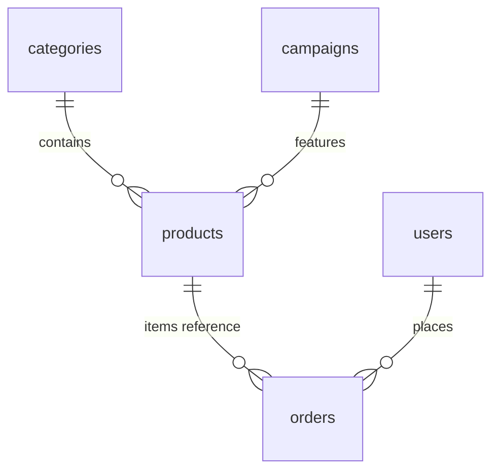

# Firestore ERD — Dami Beauty

## Collections Overview

```
categories/{id}
products/{id}
  └── variants (embedded array)
campaigns/{id}
orders/{id}
users/{uid}
instagram_posts/{id}
admin_audit/{id}
```

## Schema Details

### categories/{id}
| Field | Type | Description |
|-------|------|-------------|
| name_tr | string | Category name (Turkish) |
| slug | string | URL slug |
| sort_order | number | Display order |
| active | boolean | Visible in shop |

### products/{id}
| Field | Type | Description |
|-------|------|-------------|
| name_tr | string | Product name |
| slug | string | Unique URL slug |
| type | string | `single` \| `gift_box` \| `curation_set` |
| description_tr | string | HTML/markdown description |
| images | string[] | Firebase Storage URLs |
| base_price_try | number | Base price in kuruş (100 = ₺1) |
| category_id | string | Reference to category |
| variants | array | See Variant below |
| is_featured | boolean | Show on homepage |
| campaign_id | string? | Optional campaign link |
| gift_wrap_available | boolean | Gift wrapping option |
| active | boolean | Published state |
| created_at | timestamp | |
| updated_at | timestamp | |

**Variant (embedded)**
| Field | Type | Description |
|-------|------|-------------|
| sku | string | Unique SKU |
| options | map | e.g. `{ "scent": "rose", "card_message": "..." }` |
| price_try | number | Override price in kuruş |
| stock | number | Available quantity |
| low_stock_threshold | number | Alert threshold (default 5) |

### campaigns/{id}
| Field | Type | Description |
|-------|------|-------------|
| title_tr | string | Campaign title |
| subtitle_tr | string? | Optional subtitle |
| banner_url | string | Hero image/video URL |
| product_ids | string[] | Linked products |
| start_at | timestamp | Campaign start |
| end_at | timestamp | Campaign end |
| active | boolean | |

### orders/{id}
| Field | Type | Description |
|-------|------|-------------|
| user_id | string? | Firebase Auth UID (guest: null) |
| guest_email | string | Customer email |
| guest_phone | string | Customer phone |
| items | array | See OrderItem below |
| subtotal_try | number | Subtotal in kuruş |
| shipping_try | number | Shipping cost |
| total_try | number | Final total |
| shipping_address | map | Turkish address fields |
| status | string | `pending` \| `paid` \| `processing` \| `shipped` \| `delivered` \| `cancelled` |
| gift_wrap | boolean | Gift wrapping requested |
| gift_message | string? | Card message |
| paytr_merchant_oid | string | Unique PayTR order ID |
| paytr_status | string? | PayTR payment status |
| tracking_number | string? | Cargo tracking (admin entered) |
| notes | string? | Admin notes |
| created_at | timestamp | |
| paid_at | timestamp? | |

**OrderItem (embedded)**
| Field | Type |
|-------|------|
| product_id | string |
| variant_sku | string |
| name_tr | string |
| quantity | number |
| unit_price_try | number |

**shipping_address**
```
full_name, phone, email
il (province), ilce (district), mahalle, address_line
postal_code
```

### users/{uid}
| Field | Type | Description |
|-------|------|-------------|
| email | string | |
| phone | string? | |
| display_name | string? | |
| role | string | `customer` \| `admin` |
| addresses | array | Saved addresses |
| created_at | timestamp | |

### instagram_posts/{id}
| Field | Type | Description |
|-------|------|-------------|
| image_url | string | Cached image URL |
| post_url | string | Link to Instagram post |
| sort_order | number | Display order |
| active | boolean | |

### admin_audit/{id}
| Field | Type | Description |
|-------|------|-------------|
| admin_uid | string | |
| action | string | e.g. `order.status_change` |
| resource_type | string | |
| resource_id | string | |
| details | map | |
| created_at | timestamp | |

## Indexes (see firebase/firestore.indexes.json)

- products: `active` + `is_featured` + `created_at`
- products: `active` + `category_id` + `created_at`
- orders: `status` + `created_at`
- orders: `user_id` + `created_at`
- campaigns: `active` + `start_at`

## Relationships


